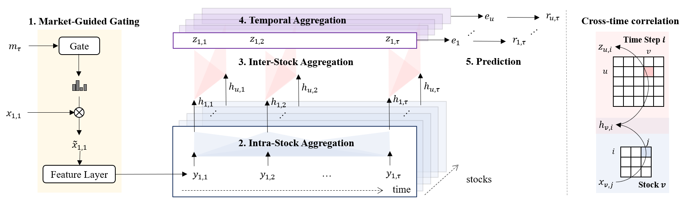

# Readme 
This is the official code and supplementary materials for our stock return prediction model. We adopt the original MASTER architecture (Market-Guided Stock Transformer) and make modifications for our new data inputs and preprocessing from AAAI-2024 paper: **MASTER: Market-Guided Stock Transformer for Stock Price Forecasting**. [[Paper]](https://ojs.aaai.org/index.php/AAAI/article/view/27767)  [[ArXiv preprint]](https://arxiv.org/abs/2312.15235) 

MASTER is a stock transformer for stock price forecasting, which models the momentary and cross-time stock correlation and guides feature selection with market information.



Our original experiments were conducted in a complex business codebase developed based on Qlib. The original code is confidential and exhaustive. In order to enable anyone to quickly use MASTER, here we publish our well-processed data and core code. 

## Usage
1. Install dependencies.
- pandas == 1.5.3
- torch == 1.11.0

2. Install [Qlib](https://github.com/microsoft/qlib). We have minimized the reliance on Qlib, and you can simply install it by
- <code>pip install pyqlib </code>

3. Run main.py to start training or evaluation.

5. Pre-trained models are available in: <code> model/model_training_0.pkl, model/model_training_1.pkl, model/model_training_2.pkl, model/model_training_3.pkl, and model/model_training_4.pkl</code>. You can load these models for evaluation or further training.


## Dataset
Our dataset is a multi-source, multi-factor collection designed for stock price forecasting in the US market. It integrates fundamental stock data, a wide range of technical factors (alphas), market index indicators, and sentiment factors to provide a rich and diverse input for forecasting models.

### Components
1. Fundamental Stock Data (NASDAQ-100):
- Time Span: January 1, 2022, to February 28, 2025.
- Variables: Daily values for close, adjusted close, open, high, low, and volume.
- Purpose: These fundamentals capture the core trading data and intrinsic stock value changes over time.

2. WorldQuant 101 / Alpha 158 Factors
- Source: Based on the WorldQuant 101 framework (see Alpha 158 factors).
- Types: Includes both alphas without industry information and alphas with industry information.
- Purpose: These technical indicators (e.g., Moving Average, Bollinger Bands, RSI, MACD, etc.) serve to capture dynamic market signals and trading patterns that have been empirically proven to relate to stock price movements.

3. Market Indices:
- Indices Included: S&P 500, NASDAQ-100, Russell 1000, Russell 3000, Wilshire 5000.
- Purpose: Instead of using a single raw index, we extract market-level information by computing current values as well as historical statistics (e.g., mean and standard deviation over various lookback periods). These indicators help reflect the overall market sentiment and conditions.

4. Sentiment Factors:
- Source: Generated by combining FinBERT (finance-specific sentiment), three separate emotion classification models, and an intent classifier.
- Resulting Columns:
    - Financial Sentiment (FinBERT): Positive, Negative, Neutral scores.
    - Aggregated Emotion Distributions: Surprise, Joy, Anger, Fear, Sadness, Disgust (each a probability).
    - Intent Sentiment: A categorical label such as Buy, Sell, Hold, Neutral, or Spam based on keywords and numeric references (e.g., “+10%”).
- Purpose: By integrating these textual signals, we capture not only bullish/bearish sentiment but also emotional tone (joy, fear, etc.) and action-oriented intent (buy, sell, etc.).

### Data Preprocessing
The published data went through the following necessary preprocessing. In this part, we describe how raw data is transformed into a clean and normalized format suitable for input into our forecasting model.

1. Fundamental Data Preprocessing:
We first compute key fundamental indicators to capture the basic trading information. Specifically:
- Typical Price: Calculated as (High+Low+Close)/3(High+Low+Close)/3, this represents a representative price for the day.
- Return: The per-ticker daily percentage change of the Close price is computed to measure stock performance.
- 5-Period VWAP: A 5-day rolling volume-weighted average price is derived from the Typical Price and Volume to reflect the average trading price adjusted for volume.

2. Fill Missing Values:
After computing these indicators, we fill any missing or NaN values with 0. This ensures that all subsequent computations receive complete data without errors.

3. Normalization for Each Column:
Finally, each column is normalized (for example, using z-score normalization) to standardize the scale across features. This step minimizes the impact of outliers and ensures consistency across the dataset.

4. Data Sorting and Splitting：
The merged dataset is first sorted chronologically by datetime to preserve the temporal order. We then split the data into training, validation, and testing sets in a 6:2:2 proportion. This careful partitioning allows the model to learn from historical data and be evaluated on unseen data. Finally, we save each split into pickle files:

```python
with open("training_input.pkl", "wb") as f:
    pickle.dump(dl_train, f)
with open("valid_input.pkl", "wb") as f:
    pickle.dump(dl_valid, f)
with open("testing_input.pkl", "wb") as f:
    pickle.dump(dl_test, f)
```   

### Data Format
The final dataset is organized into a three-dimensional tensor of shape (N,T,F), where:
- N (Number of Stocks): For example, in the NASDAQ-100 universe, N is 100.
- T (Lookback Window): We use a lookback window of 8 trading days, meaning each sample contains 8 consecutive days of data.
- F (Number of Features): In our updated dataset, F=127, which is structured as follows:
    - First 8 columns: Fundamental stock data (e.g., close, adjusted close, open, high, low, volume, etc.).
    - Next 118 columns: A comprehensive set of factors including technical indicators (WorldQuant 101 / Alpha 158), market index-derived features, and sentiment factors.
    - Last column: The label, typically a normalized return value.
      
Within the MASTER model, these 127 features are further split:
- Primary Features: Columns 0–8 (8 features) are used as the core input.
- Gating Features: Columns 9–125 (117 features) are utilized by the market-guided gating mechanism, which computes a scaling vector (of dimension dfeat=9dfeat​=9) to adjust the primary features based on current market conditions.
- The label (column 126) is used as the target during training.

  
## Model training
Our adapted MASTER model uses the following hyperparameters:
- d_feat = 9: The number of primary features (e.g., fundamental stock information) that are directly fed into the model.
- d_model = 256: The hidden dimension for transformer layers, which defines the size of internal representations.
- t_nhead = 4: The number of attention heads for temporal (intra-stock) aggregation, enabling the model to capture diverse time-dependent patterns.
- s_nhead = 2: The number of attention heads for spatial (inter-stock) aggregation, which helps to model cross-stock correlations.
- dropout = 0.5: The dropout rate applied across layers to prevent overfitting by randomly dropping units during training.
- gate_input_start_index = 9.
- gate_input_end_index = 126: These indices partition the features—columns 0–8 are used as primary features, and columns 9–125 (117 columns) are fed into the market-guided gating mechanism.
- beta = 5: A temperature parameter in the gating softmax that controls the sharpness of the feature scaling distribution.
- n_epoch = 100: The maximum number of training epochs.
- lr = 1e-5: The learning rate, set to a small value for stable convergence.
- GPU = 0: Specifies the GPU device for training.
- train_stop_loss_thred = 0.01: An early stopping threshold to halt training if the loss falls below this value, helping prevent overfitting.

## Model Ouput 
The MASTER model is designed to forecast normalized return ratios for each stock. Specifically, after processing the input tensor through market-guided gating, intra-stock aggregation, inter-stock aggregation, and temporal aggregation layers, the model produces a comprehensive embedding for each stock. This embedding is then passed through a final prediction layer (a simple linear layer) to output a continuous value representing the normalized future return.

1. Normalized Return Ratio:
The output value indicates the expected percentage change in the stock’s price over a predetermined prediction interval. The normalization (e.g., cross-sectional Z-score normalization) ensures that predictions are comparable across different stocks and trading days.

2. Interpreting Predictions:
A higher predicted value suggests a more bullish signal (i.e., the stock is expected to appreciate), while a lower predicted value indicates a bearish outlook. Because the predictions are normalized daily, they also serve as a ranking mechanism—enabling investors to identify the most promising stocks for a given day.

3. Evaluation Metrics:
The model’s output is evaluated using ranking metrics such as the Information Coefficient (IC), Rank IC, and their corresponding information ratio versions (ICIR and RankICIR). These metrics quantify how well the predicted ranking aligns with the actual future returns.


## Cite
If you use the data or the code, you can cite the original MASTER work! :smile:
```latex
@inproceedings{li2024master,
  title={Master: Market-guided stock transformer for stock price forecasting},
  author={Li, Tong and Liu, Zhaoyang and Shen, Yanyan and Wang, Xue and Chen, Haokun and Huang, Sen},
  booktitle={Proceedings of the AAAI Conference on Artificial Intelligence},
  volume={38},
  number={1},
  pages={162--170},
  year={2024}
}
```


